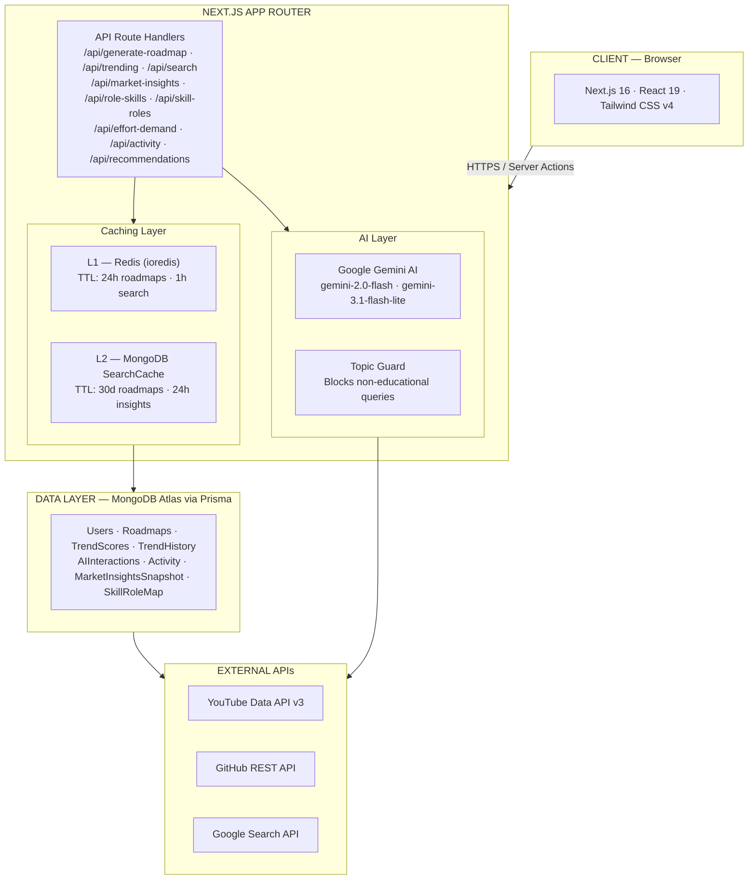
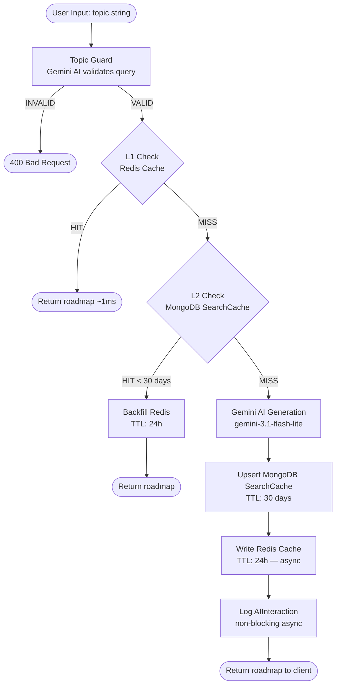
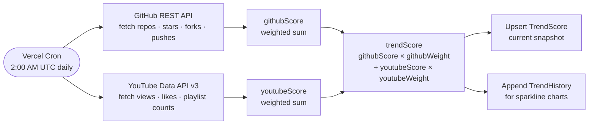
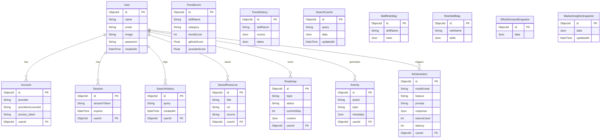

<div align="center">

<h1>Synapse</h1>

<p><strong>A Learning Intelligence Platform powered by AI, real-time market data, and multi-layer caching</strong></p>

<p>
  
  
  
  
  
  
  
</p>

<p>
  <a href="#features">Features</a> •
  <a href="#architecture">Architecture</a> •
  <a href="#tech-stack">Tech Stack</a> •
  <a href="#database-schema">Database Schema</a> •
  <a href="#api-reference">API Reference</a> •
  <a href="#getting-started">Getting Started</a> •
  <a href="#environment-variables">Environment Variables</a>
</p>

</div>

---

## Overview

Synapse is a full-stack **learning intelligence platform** built with Next.js 16 (App Router). It bridges the gap between raw learning content and job market reality by combining:

- **Deterministic market data** — GitHub stars, YouTube view trends, and job postings analyzed nightly
- **Constrained AI reasoning** — Gemini AI generates roadmaps and insights within guardrails so output is always relevant and safe
- **Multi-layer caching** — Redis L1 + MongoDB L2 cache architecture eliminates redundant API calls and reduces latency

The result is a platform that helps learners discover *what* to learn, understand *why* it matters in the job market, and get a step-by-step *how* — all in one place.

---

## Features

| Feature | Description |
|---|---|
| **AI Roadmap Generator** | Enter any topic → get a structured, step-by-step learning curriculum with tools and mini-projects at each stage |
| **Trending Skills Dashboard** | Real-time market trend scores calculated from GitHub activity and YouTube engagement, refreshed nightly via cron |
| **Skill ↔ Role Mapper** | Bidirectional graph: find which careers a skill leads to, or which skills a career demands |
| **Effort vs. Demand Chart** | Interactive scatter plot: visualize learning effort vs. market demand to identify quick wins |
| **Market Insights Feed** | AI-generated strategic insights updated every 24 hours, categorized as Trends, Warnings, or Opportunities |
| **Curated Resource Search** | Unified search across YouTube videos, playlists, and official documentation with no ads or noise |
| **User Dashboard & Activity** | Tracks search history, saved resources, roadmap progress, and learning streaks per user |
| **AI Topic Guard** | All user inputs are validated by Gemini AI before processing to block irrelevant queries |
| **Google OAuth Authentication** | One-click sign-in via NextAuth.js with a full session management lifecycle |

---

## Architecture

### System Architecture



### Request Lifecycle: AI Roadmap Generation



### Nightly Trend Score Computation



---

## Tech Stack

### Core Framework

| Layer | Technology | Purpose |
|---|---|---|
| Framework | **Next.js 16** (App Router) | Full-stack React framework, SSR/SSG, API Routes |
| Language | **TypeScript 5** | End-to-end type safety |
| UI | **React 19** | Component model, concurrent features |
| Styling | **Tailwind CSS v4** | Utility-first styling |

### Backend & Data

| Layer | Technology | Purpose |
|---|---|---|
| Database | **MongoDB Atlas** | Document store for all user and system data |
| ORM | **Prisma 5** | Type-safe database client, schema management |
| Cache L1 | **Redis** (via ioredis) | In-memory hot cache, sub-millisecond reads |
| Cache L2 | **MongoDB SearchCache** | Persistent cold cache, 30-day TTL |
| Auth | **NextAuth.js v4** + Prisma Adapter | OAuth session management (Google) |

### AI & External APIs

| Service | SDK/Client | Usage |
|---|---|---|
| **Google Gemini AI** | `@google/generative-ai` | Roadmap generation, market insights, topic validation |
| **YouTube Data API v3** | `axios` | Fetch curated video/playlist resources |
| **GitHub REST API** | `axios` | Compute repository activity trend scores |
| **Google Custom Search** | `googleapis` | Curated documentation search |

### UI Components & Charts

| Library | Purpose |
|---|---|
| `lucide-react` | Icon system |
| `@heroicons/react` | Supplementary icons |
| `recharts` | Trend charts and scatter plots |
| `@tremor/react` | Dashboard analytics components |
| `react-hot-toast` | Toast notification system |
| `next-themes` | Dark/light mode management |
| `@headlessui/react` | Accessible UI primitives |

---

## Project Structure

```
my-app/
├── app/                        # Next.js App Router
│   ├── api/                    # Server-side API Route Handlers
│   │   ├── auth/               # NextAuth.js handler
│   │   ├── generate-roadmap/   # AI roadmap generation endpoint
│   │   ├── trending/           # Trend score aggregation
│   │   ├── trending-proxy/     # Public trending data proxy
│   │   ├── trend-scores/       # Raw trend score retrieval
│   │   ├── market-insights/    # AI market insights snapshot
│   │   ├── market-analytics/   # Skill analytics aggregation
│   │   ├── effort-demand/      # Effort vs. demand scatter data
│   │   ├── search/             # Unified resource search
│   │   ├── websearch/          # Web search proxy
│   │   ├── recommendations/    # Personalized skill recommendations
│   │   ├── skill-roles/        # Skill → Roles mapping
│   │   ├── role-skills/        # Role → Skills mapping
│   │   ├── activity/           # User activity log
│   │   ├── jobs-proxy/         # Job listing proxy
│   │   ├── docs/               # Documentation fetcher
│   │   ├── user/               # User profile management
│   │   └── cron/               # Nightly cron job handler
│   ├── components/             # Shared React components
│   ├── dashboard/              # User dashboard page
│   ├── learn/                  # Learning search interface
│   ├── roadmap/                # Roadmap viewer/tracker
│   ├── trending/               # Trending skills explorer
│   ├── providers/              # React context providers
│   ├── layout.tsx              # Root layout with metadata
│   ├── page.tsx                # Landing page
│   └── globals.css             # Global styles
│
├── lib/                        # Shared server-side utilities
│   ├── gemini.ts               # Gemini AI client & model config
│   ├── prisma.ts               # Prisma client singleton
│   ├── redis.ts                # Redis client singleton
│   ├── youtube.ts              # YouTube API helpers
│   ├── topicGuard.ts           # AI-powered input validation
│   ├── skillDetectionRules.ts  # Keyword-based skill detection rules
│   ├── docs.ts                 # Documentation scraping utilities
│   ├── googleSearch.ts         # Google Search API wrapper
│   ├── duckSearch.ts           # DuckDuckGo search fallback
│   ├── github/                 # GitHub API integration
│   ├── trending/               # Trend score computation logic
│   └── youtube/                # YouTube playlist/video helpers
│
├── prisma/
│   └── schema.prisma           # Database schema definition
│
├── data/                       # Static seed/fallback data
├── scripts/                    # Database seeding & maintenance scripts
├── public/                     # Static assets (images, demo video)
├── next.config.js              # Next.js configuration
├── tailwind.config.ts          # Tailwind CSS theme configuration
└── vercel.json                 # Vercel deployment configuration
```

---

## Database Schema

Synapse uses **MongoDB Atlas** as its primary datastore, accessed through **Prisma ORM**. Below is the full entity relationship model:



---

## API Reference

All API routes are under `/api/` and follow the Next.js App Router convention.

### Resource Search

| Method | Endpoint | Description |
|---|---|---|
| `GET` | `/api/search?q={query}` | Unified search: YouTube videos, playlists, and documentation |
| `GET` | `/api/docs?q={query}` | Fetch official documentation for a topic |
| `GET` | `/api/websearch?q={query}` | General web search proxy |

### AI-Powered Features

| Method | Endpoint | Description |
|---|---|---|
| `POST` | `/api/generate-roadmap` | Generate a structured learning roadmap `{ topic: string }` |
| `GET` | `/api/market-insights` | Fetch or generate AI market intelligence feed |
| `POST` | `/api/market-insights` | Force-refresh market insights (used by cron) |
| `GET` | `/api/effort-demand` | Effort vs. demand scatter plot data |
| `GET` | `/api/recommendations` | Personalized skill recommendations for the current user |

### Market & Trend Data

| Method | Endpoint | Description |
|---|---|---|
| `GET` | `/api/trend-scores` | Raw trend scores for all tracked skills |
| `GET` | `/api/trending-proxy` | Public proxy for trending skill data |
| `GET` | `/api/market-analytics` | Aggregated category-level statistics |
| `GET` | `/api/skill-roles?skill={name}` | Get job roles for a given skill |
| `GET` | `/api/role-skills?role={name}` | Get required skills for a given role |
| `GET` | `/api/jobs-proxy?q={query}` | Job listing search proxy |

### User Data

| Method | Endpoint | Description |
|---|---|---|
| `GET` | `/api/activity` | Fetch the authenticated user's activity log |
| `POST` | `/api/activity` | Log a new user activity event |
| `GET/PATCH` | `/api/user` | Get or update the current user's profile |
| `GET` | `/api/roadmap` | List all roadmaps for the current user |
| `POST` | `/api/roadmap` | Save a new roadmap for the current user |

### System

| Method | Endpoint | Description |
|---|---|---|
| `GET` | `/api/cron` | Nightly data refresh: recomputes all trend scores |
| `GET/POST` | `/api/auth/[...nextauth]` | NextAuth.js authentication handler |

---

## Caching Strategy

Synapse uses a **two-tier cache-aside pattern** to minimize external API calls and AI token costs:

```
Request
  │
  ├─► Redis (L1)       → HIT: return in ~1ms
  │     TTL: 1h–24h    → MISS: check L2
  │
  ├─► MongoDB (L2)     → HIT: backfill L1, return
  │     TTL: 24h–30d   → MISS: fetch from source
  │
  └─► Source           → AI / External API
        └─► Write to L2 → Write to L1
```

| Data Type | Redis TTL | MongoDB TTL |
|---|---|---|
| Roadmaps | 24 hours | 30 days |
| Search results | 1 hour | 24 hours |
| Market insights | — | 24 hours |
| Trend scores | — | Updated on cron |

> Redis is optional. If `REDIS_URL` is not set, the system gracefully falls back to MongoDB-only caching.

---

## Getting Started

### Prerequisites

- **Node.js** >= 18.0
- **npm** >= 9.0
- A **MongoDB Atlas** cluster (M0 free tier works)
- A **Redis** instance (Upstash free tier recommended for serverless)

### 1. Clone the Repository

```bash
git clone https://github.com/your-username/synapse.git
cd synapse/my-app
```

### 2. Install Dependencies

```bash
npm install
```

### 3. Configure Environment Variables

Create a `.env` file in the root directory. See the [Environment Variables](#environment-variables) section for the full list.

### 4. Initialize the Database

```bash
# Generate the Prisma client
npx prisma generate

# Push the schema to your MongoDB Atlas cluster
npx prisma db push
```

### 5. Seed Trend Data (Optional)

```bash
# Seed the database with initial skill trend scores
node scripts/seed-trends.js
```

### 6. Run the Development Server

```bash
npm run dev
```

Open [http://localhost:3000](http://localhost:3000) to view the app.

---

## Environment Variables

Create a `.env` file at the project root with the following variables:

```env
# ─── Database ──────────────────────────────────────────────
DATABASE_URL="mongodb+srv://<user>:<password>@<cluster>.mongodb.net/<db>?retryWrites=true&w=majority"

# ─── Authentication ─────────────────────────────────────────
NEXTAUTH_URL="http://localhost:3000"
NEXTAUTH_SECRET="your-nextauth-secret-min-32-chars"

GOOGLE_CLIENT_ID="your-google-oauth-client-id"
GOOGLE_CLIENT_SECRET="your-google-oauth-client-secret"

# ─── AI ─────────────────────────────────────────────────────
GEMINI_API_KEY="your-gemini-api-key"

# ─── External APIs ──────────────────────────────────────────
YOUTUBE_API_KEY="your-youtube-data-api-v3-key"
GITHUB_TOKEN="your-github-personal-access-token"
GOOGLE_API_KEY="your-google-api-key"
GOOGLE_CX="your-custom-search-engine-id"

# ─── Cache (Optional) ───────────────────────────────────────
REDIS_URL="rediss://:your-password@your-host.upstash.io:6379"
```


### Obtaining API Keys

| Key | Where to get it |
|---|---|
| `GEMINI_API_KEY` | [Google AI Studio](https://aistudio.google.com/app/apikey) |
| `YOUTUBE_API_KEY` | [Google Cloud Console](https://console.cloud.google.com/) → YouTube Data API v3 |
| `GOOGLE_CLIENT_ID/SECRET` | [Google Cloud Console](https://console.cloud.google.com/) → OAuth 2.0 Credentials |
| `GITHUB_TOKEN` | [GitHub Settings](https://github.com/settings/tokens) → Personal Access Tokens |
| `REDIS_URL` | [Upstash Console](https://console.upstash.com/) (free tier) |

---

## Deployment

### Deploy to Vercel (Recommended)

```bash
# 1. Install Vercel CLI
npm i -g vercel

# 2. Deploy
vercel
```

Set all environment variables in the **Vercel Project Dashboard → Settings → Environment Variables**.

The `vercel.json` in the project root handles routing configuration. The `build` script runs `prisma generate` automatically before the Next.js build.

### Nightly Cron Job

Vercel Cron is used to refresh trend scores daily. Add the following to `vercel.json`:

```json
{
  "crons": [{
    "path": "/api/cron",
    "schedule": "0 2 * * *"
  }]
}
```

This triggers at **2:00 AM UTC** daily, fetching fresh data from GitHub and YouTube and updating `TrendScore` and `TrendHistory` collections.

---

## Scripts

Utility scripts are located in `/scripts/` for database maintenance:

| Script | Purpose |
|---|---|
| `seed-trends.js` | Seeds the database with initial skill trend data for ~100+ skills |
| `flush-cache.js` | Clears all entries in the `SearchCache` collection |
| `fix-zero-history.js` | Backfills missing history entries for skills with zero-score history |
| `check-categories.js` | Audits skill categories in the `TrendScore` collection |
| `check-data.js` | Verifies data integrity across the trend collections |
| `cleanup.mjs` | Removes stale or orphaned database records |
| `debug-env.js` | Validates that all required environment variables are present |
| `test-db.js` | Smoke test for MongoDB Atlas connectivity |

---

## Contributing

1. Fork the repository
2. Create a feature branch: `git checkout -b feature/your-feature-name`
3. Commit your changes: `git commit -m 'feat: add your feature'`
4. Push to the branch: `git push origin feature/your-feature-name`
5. Open a Pull Request

---

## License

This project is licensed under the **MIT License**.

---

<div align="center">
  <p>Built with Next.js · MongoDB · Redis · Google Gemini AI</p>
</div>
